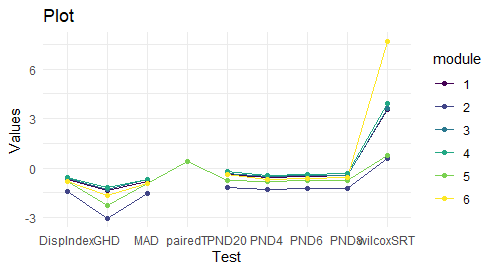
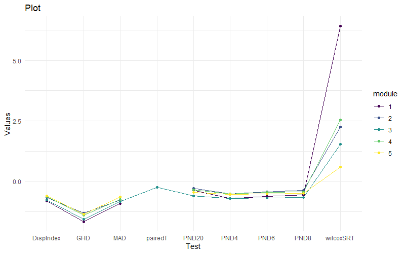

# Enhancing Gene Network Analysis: A Comparative Study of DiNA Using the p-Norm Difference Test

This study focuses on a scientific study by [Arbet et al.](https://www.frontiersin.org/journals/genetics/articles/10.3389/fgene.2021.630215/full#B30) which evaluates different statistical methods to identify Differentially Co-expressed Modules (DCMs) in gene networks using Differential Network Analysis (DiNA). Then authors tested a new method, the p-norm difference test (PND), against traditional approaches through simulations and real data analysis. The outcome is the `discoMod` R package, equipped with tools for visualizing networks, testing for DCMs, and clustering genes. Our findings show that PND is an effective alternative to standard methods, as it successfully lowers the false positive rate while keeping a good true positive rate. Here using three different types of dataset Such as Golub, BioNet Refence dataset, and GEO (Genes Expression Omnibus) dataset to compare the analysis.
Here, I attempted to reimplement the [`discoMod`](https://github.com/arbet003/discoMod) and further applied downstream analysis to it.

 ## Methodology
The methodology for analyzing gene networks through Differential Network Analysis (DiNA) is detailed [here.](methodology.md)

### Hyperparameters:
The parameters for this methodology are provided [here.](hyperparameters.md)


##  Documentation of Discomod Library

## Technology used

- **R**: Used for all statistical computing and graphics.
- ***discoMod R package***: Developed specifically for this project to facilitate the differential network analysis.
- ***GitHub***: Used for version control.
 
## Tutorial
For a tutorial, see the example near the end of the following help page:

``` r
library(discoMod)
?test_modules
```

 ## Installation / Run the Project 
 ### Prerequisites:
 - R programming language (Version 3.6 or later recommended)
 - RStudio (For running R scripts)

### Libraries:
 Need to install the following R packages:

``` r
install.packages("devtools")
devtools::install_github("arbet003/discoMod")
```

### Additional Libraries:
```r
install.packages("mclust")
install.packages("foreach")
install.packages("BiocManager")
BiocManager::install("multtest")
```

and After installation, you can load the package and use its functions as follows: 
```r
library(foreach)
library(devtools)
library(multtest)
library(mclust)
```

### Golub Dataset:
For the dataset that paper used from the BiocManager, need to write the followings:
```r
data(golub.cl)
```


## How to Use the Project
To use this project, follow these steps:

1. Install the **discoMod** package as shown above.

2. Prepare your gene expression data in the correct format (see Input File Format Specification below).

3. Run the code that is given in code section using functions, passing data as the argument.

4. Analyze the results using the visualization and summary functions provided by the package.


## Input file format specification

For the data, need to use above dataset section.
The input file should be a TSV file with the following specifications:

- Each row represents a gene .
- Each column represents a sample (except the first column, which contains gene identifiers).
- The first row contains sample identifiers


## Output file format specification
The output from the discoMod package functions will typically be an object containing:

- A list of DCMs identified.
- Statistical significance levels for each module.
- Visualization plots (saved as PNG files).

Camparison of all statistical modules and the new PND module. 

## Implementation of Discomod (Code Execution):

### library Installations:
```r
if (!require('devtools')) {
  install.packages('devtools')
}
if (!require('mclust')) {
  install.packages('mclust')
}
if (!require('foreach')) {
  install.packages('foreach')
}

library(foreach)
library(devtools)
devtools::install_github("arbet003/discoMod")

library(mclust)
```

### BioNet Reference Data:
```r
# load the data -- the path where dataset save in your local pc
data1 <- read.table("./reference_datasets/500_genes/out_CD8_exhausted.tsv")
data2 <- read.table("./reference_datasets/500_genes/out_Macrophages.tsv")
```
As we are using reference data of CD8 and Microphages, data need to be pre-processed first.  
### Data pre processing:

1. First row and column deletation
2. Row added to rownames

```r
# delete top rows (label names)
data1 <- data1[-1,]
data2 <- data2[-1,]

# separate 1st column and set it as row names
rows = data1[, 1]
data1 = data1[, -1]
rownames(data1) = rows

rows = data2[, 1]
data2 = data2[, -1]
rownames(data2) = rows
```
Among the proceed data, it finds modules (where gene >= 3)
```r
#Find the module by using find_module functions
modules = discoMod::find_modules(data1, data2, cluster_group=2)
modules$num_modules
```

3.  String need to convert to numeric:
```r
# convert to numeric format
for (i in seq_along(modules$group1_modules)) {
  if (length(modules$group1_modules[[i]]) > 0) {
    modules$group1_modules[[i]] = apply(modules$group1_modules[[i]], c(1, 2), as.numeric)
  }
}

for (i in seq_along(modules$group2_modules)) {
  if (length(modules$group2_modules[[i]]) > 0) {
    modules$group2_modules[[i]] = apply(modules$group2_modules[[i]], c(1, 2), as.numeric)
  }
}
```
Among all the module, test specific modules ( which Modules are performed DCM):
```r
testmods = discoMod::test_modules(group1_modules = modules$group1_modules , group2_modules = modules$group2_modules)

```
### Visualization using Correlation heatmap & ggplot:
```r
heat = discoMod::corrheatmap(modules$group1_modules[[1]], modules$group2_modules[[1]])
#for correlation heatmap
plot(heat$both_plots)
# plot(heat$group1_plot)
# plot(heat$group2_plot)

#for line graph
library(tidyr)
library(viridis)
library(ggplot2)

graph_data = testmods$test_stats
graph_data$module = rownames(graph_data)
graph_data <- pivot_longer(graph_data, cols= -module, names_to = 'Test', values_to = 'Values')

plot <- ggplot(data = graph_data, aes(x = Test, y = log10(Values), group= module, color= module)) +
geom_line() +
geom_point() +
labs(x= 'Test', y= 'Values', title = 'Plot') +
theme_minimal() +
scale_colour_viridis(discrete = TRUE)

plot
```

## Downstream Analysis:

### GEO [Dataset](https://www.ncbi.nlm.nih.gov/geo/query/acc.cgi?acc=GSE206793) -

#### Load Geo Dataset:

```r
data <- read.table("./reference_datasets/GSE206793_expression.tsv")
# extracting 2 different phenotype data
data1 <- data %>% select(contains("prostate.cancer_M1"))
data2 <- data %>% select(contains("prostate.cancer_N0M0"))
```

```r
# resizing to have equal number of samples in two dataset
data2 <- data2[, 0:31]
set.seed(1234)
ind = sample(1:nrow(data1),200)
# randomly selecting 200 gene data
data1 = data1[ind,]
data2 = data2[ind,]
```
After loading the data, others process are same as above.

***Comparison***:
### Correlation Heatmap Comparison:
_As the main corheatmap function have done the code as manually, It was not possible to change the group name._

***Reference Dataset***:

The provided image displays two Spearman's correlation heatmaps for two different groups—Group 1 (CD8) and Group 2 (Macrophages). These heatmaps visualize the differential co-expression of a specific gene module, labeled as module number 22, which contains 26 genes. The analysis is focused on comparing the gene interaction patterns between the CD8 data group and the Macrophages data group.
    
***GEO Dataset***:


The image depicts two Spearman's correlation heatmaps representing the co-expression patterns of genes within a specific module (module number 5 containing 23 genes) across two different groups of prostate cancer: Group 1 (prostate cancer-M1) and Group 2 (prostate cancer-N0M0). These heatmaps are used to visualize how gene expressions correlate with each other within each group, highlighting differences in gene interactions between metastatic and non-metastatic prostate cancer.


### Line graph Comparison:
***Reference Dataset***:



The provided line graph illustrates the performance of different statistical tests across six modules, measuring the correlation differences between the same modules across different groups. The graph is designed to highlight how each test discriminates or detects changes in gene correlations within specific gene modules. A significant spike in the values for the PND20 test in Module 6 indicates a high sensitivity or effectiveness in detecting differences for this module. This suggests that PND20 might be particularly adept at identifying subtle or significant changes in gene correlations that other tests might miss.


***GEO Dataset***:


The line graph presented here illustrates the performance of different statistical tests applied across five distinct gene modules. Each line represents the results of the tests for one module, showing how the test values vary among different statistical methods. The sharp increase in test values for PND8 and Wilcoxon SRT with Module 5 might indicate that these methods are particularly effective in identifying distinct or strong differences in gene correlation patterns, which might be subtle or not detectable by the other tests.

## Result 

The analysis using the Golub dataset demonstrated that the PND method significantly outperformed traditional statistical approaches in identifying Differentially Co-expressed Modules (DCMs). This was particularly notable in the accuracy of detecting true positive changes in gene network structures, making PND a robust choice for datasets with similar characteristics.  
In contrast, the application of the PND method to the CD8 and Macrophages datasets and GEO datasets did not yield as definitive results. The method encountered challenges in consistently identifying significant differences in the network structures. This inconsistency suggests potential limitations of PND when applied to datasets with certain biological complexities or differing underlying network dynamics. 

## Reference to the study


Arbet, J., Zhuang, Y., Litkowski, E., Saba, L., & Kechris, K. (2021). Comparing Statistical Tests for Differential Network Analysis of Gene Modules. Frontiers in genetics, 12, 748.
["Comparing Statistical Tests for Differential Network Analysis of Gene Modules."](https://www.frontiersin.org/journals/genetics/articles/10.3389/fgene.2021.630215/full#B30).


