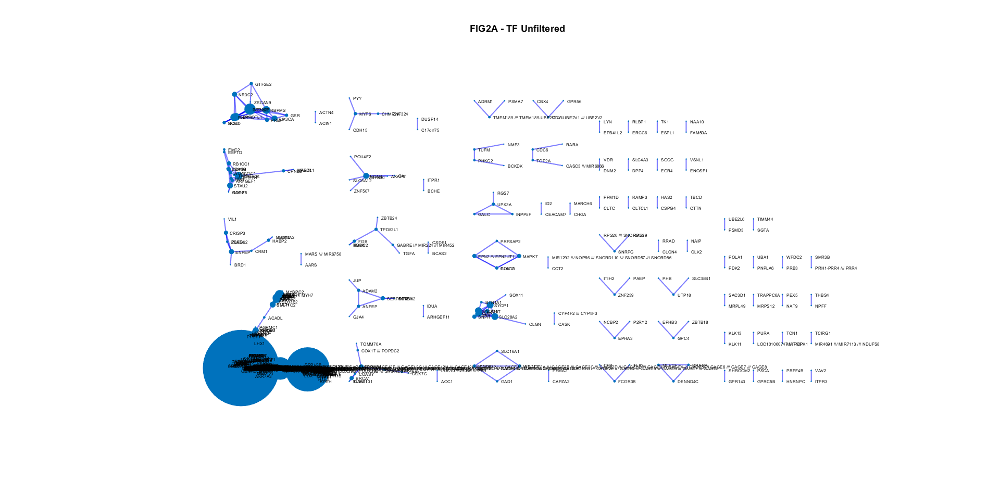
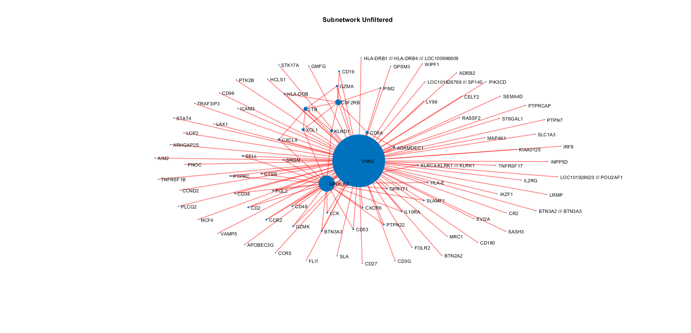
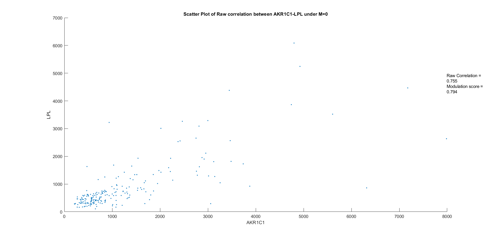
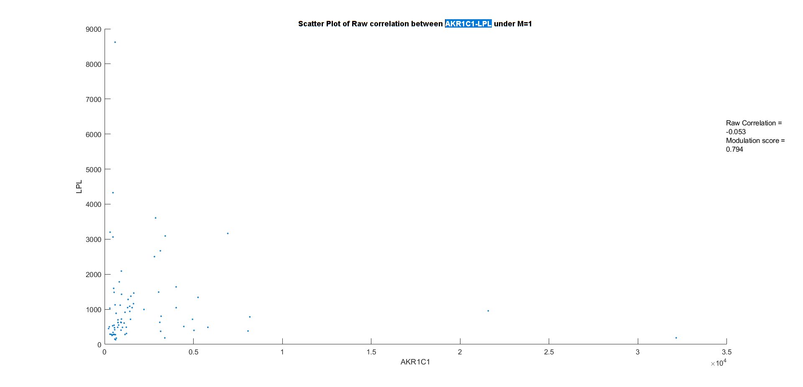
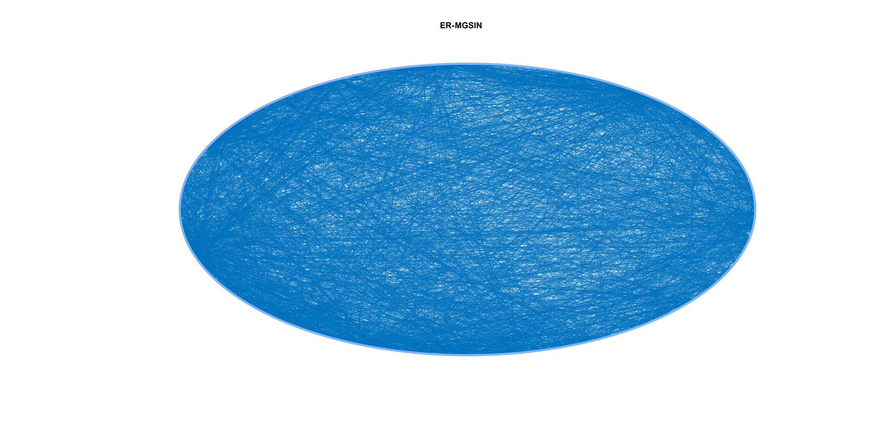
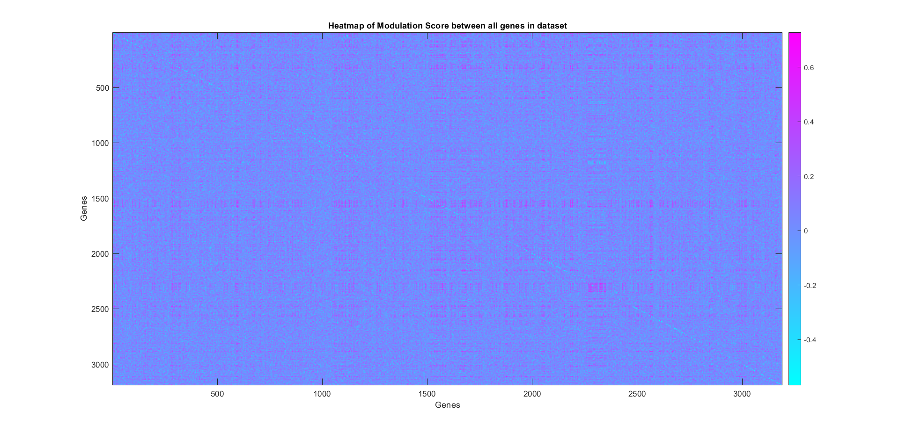
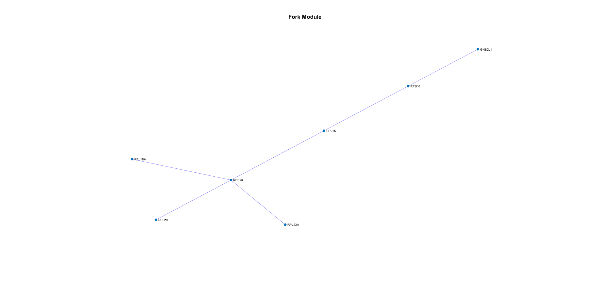
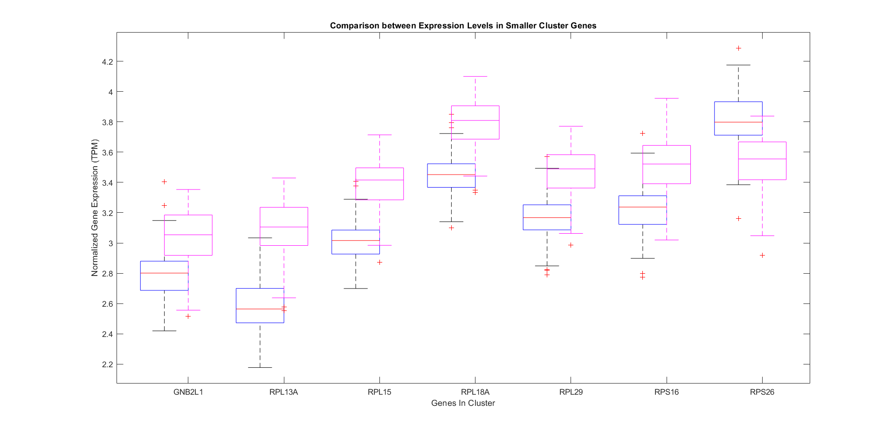
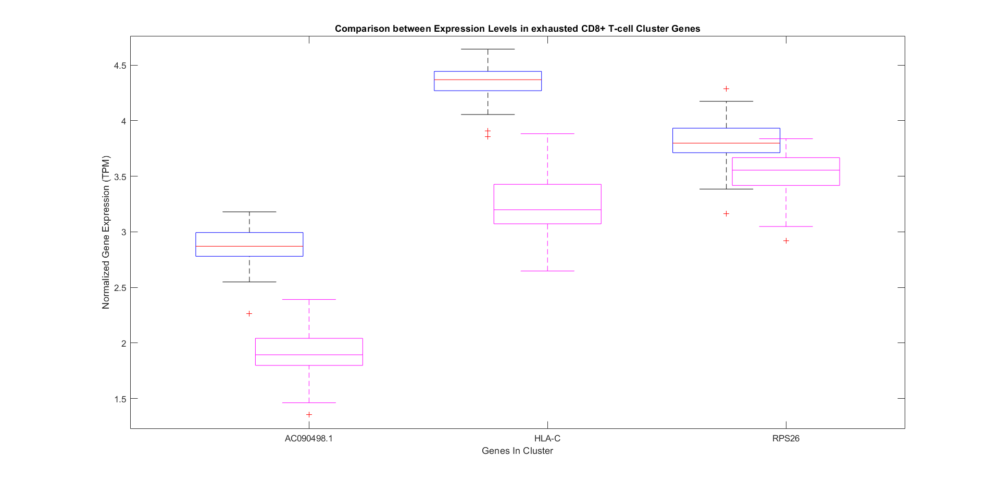

This README.md file was generated on 13/5/2024 by Anisa Llukacaj (anis.llukacaj@fau.de)
# MAGIC: Modulated Gene/Gene Set Interaction Analysis

MAGIC is a MATLAB tool used for the identification of differentially regulated gene pairs which are modulated by the state of a modulator protein, which influences the activity of transcription factors. Each pair that is identified is correlated (positively or negatively) in one of the modulation states. 
Within the context of this repository, it has been modified to generate the Differential Gene Regulatory Network of two gene expression datasets under different conditions.
The tool can also be used on to discover differential gene set interactions.

For each identified gene pairs, it is indicated that in one of the conditions, the interaction between them is either significantly upregulated or downregulated. 

### Brief Description of Algorithm & Recommended Use
For the generation of the DGRN, MAGIC performs Fisher-transformed pairwise correlation between genes inter-conditionally. A modulation analysis step is performed to identify the biologically and statistically meaningful gene pairs. This step involves a modulation test on the Fisher transformed  correlation coefficients (for distribution normalization) to test for statistically meaningful differential correlation and a modulation score calculation based on the inverse Fisher transformation using the equivalent sample size.Gene pairs that meet the criteria of the modulation analysis are assigned an edge weight that informs on the type of correlation(positive/negative) and the condition under which this interaction is observed. 

A more detailed overview of the algorithm can be found on the [Wiki](https://github.com/bionetslab/grn-benchmark/wiki#matlab-tool-for-modulated-genegene-set-interaction-magic-analysis)

Due to the fact that the tool generates a network where edge weights only inform on the type of interaction (positive or negative correlation under each condition), it is best used for an extension of its intended purpose; to investigate the effects of a condition on gene expression among similar samples.

### Requirements
- [MATLAB (preferrably r2023a)](https://de.mathworks.com/help/install/ug/install-products-with-internet-connection.html)[1]
- [Bioinformatics Toolbox](https://de.mathworks.com/products/bioinfo.html)[2]
- [Statistics and Machine Learning Toolbox](https://de.mathworks.com/products/statistics.html)[3]
- [Community Detection Toolbox](https://de.mathworks.com/matlabcentral/fileexchange/45867-community-detection-toolbox)[4]

## Installation Instructions:
Once you have MATLAB installed, the easiest way to install Toolboxes in MATLAB is through the Add-On Explorer. 

To use MAGIC, clone this repository.
```
git clone https://github.com/bionetslab/grn-benchmark
cd src/magic-tool
```

# Instructions
This section provides a guide on how to use the scripts in the repository:
1. [General Implementation: MAGIC tool](#magic_tool)
2. [General Implementation: MAGIC visualization](#magic_visualization)
3. [Reproduction: Visualization Reproduction with GSE2034 Dataset](#gse2034)
4. [Reproduction: Gene Set Reproduction with GSE2034 Dataset](#geneset)
5. [Reproduction: Visualization Reproduction with Reference Dataset](#ref_data)
6. [Downstream Analysis](#downstream)

<a id="magic_tool"></a>
## General Implementation: magic_tool.m

Generation of a Differential Gene Regulatory Network from two datasets. 

MAGIC can be run with default parameters as well as user-defined parameters:

**Usage**
```
matlab -r "magic_tool('input1_filepath', 'input2_filepath', 'output_path', 'bonf', 1, 'equ_sam_size', 100, 'p_cutoff', 0.05, 'mod_score_cutoff', 0.6);"
```
**Arguments**
  1.  `input1_filepath`: path to a TSV file containing normalized gene expression under condition 1
      - column 1 -> Gene: containing gene names
      - other columns -> Names of samples: containing gene expression for each gene within the sample
  2.  `input2_filepath`: path to a TSV file containing normalized gene expression under condition 2
      - column 1 -> Gene: containing gene names
      - other columns -> Names of samples: containing gene expression for each gene within the sample
  3. `output_path`: directory where you want the results to be stored
  4. Additional parameters (optional)
      - `bonf`:  flag for Bonferroni correction 
        - if set to 0, raw p-values will be analyzed
        - if set to 1, Bonferroni correction will be performed
        - DEFAULT: 1
      - `equ_sam_size`: numeric, equivalent sample size
        - sample size at which the correlation coefficients for sample sizes are compared
        - DEFAULT: the average of samples from each input/condition
      - `p_cutoff`: threshold p-value to determine the statistical significance of interactions
        - DEFAULT: 0.05
      - `mod_score_cutoff`: threshold to determine the biological significance of interactions
        - DEFAULT: 0.6
       
Alternatively, to use the tool with default parameters:
```
matlab -r "magic_tool input1_filepath input2_filepath output_path"
```

  **Note**
  - `output_path` directory must exist prior to the execution of the script
  - Ensure that the Gene columns of both inputs are identical. Number of samples per condition is arbitrary. 

### Output
The tool generates three files:
1. network.tsv: TSV file containing all the edges of the DGRN with the following columns
    - Target: target gene of the edge
    - Regulator: source gene of the edge
    - Condition: condition that the edge belongs to
    - Weight: weight of the edge
      -  1: conditon 2 specific negative correlation
      -  2: condition 2 specific positive correlation
      -  -1: condition 1 specific positive correlation
      -  -2: condition 1 specific negative correlation
2. modulated_network.tsv: TSV file containing all the edges of the DGRN with the following columns
    - Target: target gene of the edge
    - Regulator: source gene of the edge
    - Condition: condition that the edge belongs to
    - Weight: weight of the edge, defined by modulation score
3. modulation.txt: TXT file automatically generated by the MAGIC algorithm intended to be used with the Cytoscape visualization software. It contains the following columns
    - Gene1: gene 1 of pair
    - Gene2: gene 2 of pair
    - Raw corr in M=1: raw correlation of Gene1 and Gene2 in condition 2 samples
    - Raw corr in M=0: raw correlation of Gene1 and Gene2 in condition 1 samples
    - P-value: p-value of interaction [0,1]
    - Modulation Score: modulation score of interaction. Larger positive values indicate a stronger correlation in condition 2 samples
  
**Working Example**
```
 matlab -r "magic_tool('Datasets\out_CD8_exhausted.tsv', 'Datasets\out_Macrophages.tsv', 'Results');"
```
or
```
 matlab -r "magic_tool Datasets\out_CD8_exhausted.tsv Datasets\out_Macrophages.tsv Results"
```
<a id="magic_visualization"></a>
## General Implementation: magic_visualization

This script can be used to obtain the visualizations used in the paper by Hsiao, T.-H. et al.[5] for any dataset.

magic_visualization can be run with default parameters as well as user-defined parameters:

**Usage**
```
matlab -r "magic_visualization('input1_filepath', 'input2_filepath', 'output_path', 'bonf', 1, 'equ_sam_size', 100, 'p_cutoff', 0.05, 'mod_score_cutoff', 0.6);"
```
**Arguments**
  1.  `input1_filepath`: path to a TSV file containing normalized gene expression under condition 1
      - column 1 -> Gene: containing gene names
      - other columns -> Names of samples: containing gene expression for each gene within the sample
  2.  `input2_filepath`: path to a TSV file containing normalized gene expression under condition 2
      - column 1 -> Gene: containing gene names
      - other columns -> Names of samples: containing gene expression for each gene within the sample
  3. `output_path`: directory where you want the results to be stored
  4. Additional parameters (optional)
      - `bonf`:  flag for Bonferroni correction 
        - if set to 0, raw p-values will be analyzed
        - if set to 1, Bonferroni correction will be performed
        - DEFAULT: 1
      - `equ_sam_size`: numeric, equivalent sample size
        - sample size at which the correlation coefficients for sample sizes are compared
        - DEFAULT: the average of samples from each input/condition
      - `p_cutoff`: threshold p-value to determine the statistical significance of interactions
        - DEFAULT: 0.05
      - `mod_score_cutoff`: threshold to determine the biological significance of interactions
        - DEFAULT: 0.6
       
Alternatively, to use the tool with default parameters:
```
matlab -r "magic_visualization input1_filepath input2_filepath output_path"
```
  **Note**
  - `output_path` directory must exist prior to the execution of the script
  - Ensure that the Gene columns of both inputs are identical. Number of samples per condition is arbitrary.
  - This script does not produce a TSV file

### Output
This script produces one TXT file and several visuals. 
1. modulation.txt: TXT file automatically generated by the MAGIC algorithm intended to be used with the Cytoscape visualization software. It contains the following columns
    - Gene1: gene 1 of pair
    - Gene2: gene 2 of pair
    - Raw corr in M=1: raw correlation of Gene1 and Gene2 in condition 2 samples
    - Raw corr in M=0: raw correlation of Gene1 and Gene2 in condition 1 samples
    - P-value: p-value of interaction [0,1]
    - Modulation Score: modulation score of interaction. Larger positive values indicate a stronger correlation in condition 2 samples
2. VISUAL: DGRN
    - Nodes: Genes
    - Edges: Regulatory Interaction
        - red indicates downregulatory interaction
        - blue indicates upregulatory interaction 
3. VISUAL: Hub Gene Subnetworks
    - subnetwork of hub genes chosen using 3-sigma rule, consisting of hub genes and connected nodes
4. VISUAL: Scatter plots with raw correlation for gene pair with highest modulation score
    - Scatter plot of raw correlation in condition 1 samples
    - Scatter plot of raw correlation in condition 2 samples


**Working Example**
```
 matlab -r "magic_visualization('Datasets\out_CD8_exhausted.tsv', 'Datasets\out_Macrophages.tsv', 'Results');"
```
or
```
 matlab -r "magic_visualization Datasets\out_CD8_exhausted.tsv Datasets\out_Macrophages.tsv Results"
```

<a id="gse2034"></a>
## Reproduction: reproduction_GSE2034
This script reproduces the visualizations used in the paper by Hsiao, T.-H. et al.[5] using the reference dataset (Macrophages and exhausted CD8+ T-cells).

**Usage**
```
matlab -r "reproduction_reference_data output_path"
```
**Argument**
- `output_path`: directory where you want the results to be stored
  - must exist prior to execution

**Note**
For reproductions, make sure to have the Datasets folder in the working directory for all the necessary data. 


 ### Output
1. unfiltered_network.tsv: TSV file containing all the edges of the DGRN prior to giltering for Target Factors (from AertsLab) with the following columns
    - Target: target gene of the edge
    - Regulator: source gene of the edge
    - Condition: condition that the edge belongs to
    - Weight: weight of the edge
      -  1: conditon 2 specific negative correlation
      -  2: condition 2 specific positive correlation
      -  -1: condition 1 specific positive correlation
      -  -2: condition 1 specific negative correlation
2. network.tsv: TSV file containing all the edges of the TF-filtered DGRN with the following columns
    - Target: target gene of the edge
    - Regulator: source gene of the edge
    - Condition: condition that the edge belongs to (ER+ or ER- samples)
    - Weight: weight of the edge
      -  1: conditon 2 specific negative correlation
      -  2: condition 2 specific positive correlation
      -  -1: condition 1 specific positive correlation
      -  -2: condition 1 specific negative correlation
3. modulation_gse2034.txt: TXT file automatically generated by the MAGIC algorithm intended to be used with the Cytoscape visualization software. It contains the following columns
    - Gene1: gene 1 of pair
    - Gene2: gene 2 of pair
    - Raw corr in M=1: raw correlation of Gene1 and Gene2 in condition 2 samples
    - Raw corr in M=0: raw correlation of Gene1 and Gene2 in condition 1 samples
    - P-value: p-value of interaction [0,1]
    - Modulation Score: modulation score of interaction. Larger positive values indicate a stronger correlation in condition 2 samples
2. VISUAL: ER-modulated gene interaction network (ER-MGIN) in breast cancer - TF Unfiltered
    - Nodes: Genes
    - Edges: ER-modulated Interaction
        - red indicates downregulatory interaction
        - blue indicates upregulatory interaction
   
3. VISUAL: Hub Gene Subnetwork (VNN2) - TF Unfiltered
      - subnetwork of VNN2, consisting of hub genes and connected nodes
   
4. VISUAL: ER-modulated gene interaction network (ER-MGIN) in breast cancer - TFFiltered
    - Nodes: Genes
    - Edges: ER-modulated Interaction
        - red indicates downregulatory interaction
        - blue indicates upregulatory interaction
   
5. VISUAL: Hub Gene Subnetworks (7 Identified Hub Genes) - TF Filtered
6. VISUAL: Scatter plots with raw correlation for gene pair with highest modulation score
    - SPINK1-SCGN gene pair
    - The gene pair AKR1C1-LPL was identified as the gene pair with the highest modulation score in the original study, however this was identified as the gene pair with highest modulation score using this script.
    - Scatter plot of raw correlation in ER- samples
    - Scatter plot of raw correlation in ER+ samples
7. VISUAL: Scatter plots of AKR1C1-LPL Gene Pair
    - This is the gene pair identified as having the highest modulation score in the original study, and the two scatter plots were constructed for this pair as well. They have been added below



<a id="geneset"></a>
## Reproduction: magic_gene_set_reproduction
This script reproduces the gene set application of the MAGIC tool. For more information on how this is done, look at the [Wiki](https://github.com/bionetslab/grn-benchmark/wiki#matlab-tool-for-modulated-genegene-set-interaction-magic-analysis)

**Usage**
```
matlab -r "magic_gene_set_reproduction output_path"
```
**Argument**
- `output_path`: directory where you want the results to be stored
  - must exist prior to execution

**Notes**
For reproductions, make sure to have the Datasets folder in the working directory for all the necessary data. 
The script takes a while, please be patient. 

The gene expression dataset for this script was GSE2034, as well as the following gene set categories from the Molecular Signatures Database (MSigDB) v3.1:
- CGP (Chemical and genetic perturbations)
- TFT (Transcription Factor Targets)
- GO (Gene Ontology)
- OS (Oncogenic Signatures)
- CB (Cytogenic Bands)

  ### Output
1.  network.tsv: TSV file containing all the edges of the TF-filtered DGRN with the following columns
    - Target: target gene of the edge
    - Regulator: source gene of the edge
    - Condition: condition that the edge belongs to
    - Weight: weight of the edge
      -  1: conditon 2 specific negative correlation
      -  2: condition 2 specific positive correlation
      -  -1: condition 1 specific positive correlation
      -  -2: condition 1 specific negative correlation
2. ER-MGSIN.txt: TXT file automatically generated by the MAGIC algorithm intended to be used with the Cytoscape visualization software. It contains the following columns
    - Gene1: gene set 1 of pair
    - Gene2: gene set 2 of pair
    - Raw corr in M=1: raw correlation of Gene1 and Gene2 in condition 2 samples
    - Raw corr in M=0: raw correlation of Gene1 and Gene2 in condition 1 samples
    - P-value: p-value of interaction [0,1]
    - Modulation Score: modulation score of interaction. Larger positive values indicate a stronger correlation in condition 2 samples
3. VISUAL: ER-modulated gene set interaction network (ER-MGSIN) in breast cancer
    - Nodes: Gene Sets
    - Edges: Regulatory Interactions determined using gene expression data
   
  


<a id="ref_data"></a>
## Reproduction: reproduction_reference_data
This script reproduces the visualizations used in the paper by Hsiao, T.-H. et al. using the GSE2034 breast cancer dataset.

**Usage**
```
matlab -r "reproduction_reference_data output_path"
```
**Argument**
- `output_path`: directory where you want the results to be stored
  - must exist prior to execution
   
**Note**
For reproductions, make sure to have the Datasets folder in the working directory for all the necessary data.

 ### Output
1. network.tsv: TSV file containing all the edges of the DGRN with the following columns
    - Target: target gene of the edge
    - Regulator: source gene of the edge
    - Condition: condition that the edge belongs to
    - Weight: weight of the edge
      -  1: conditon 2 specific negative correlation
      -  2: condition 2 specific positive correlation
      -  -1: condition 1 specific positive correlation
      -  -2: condition 1 specific negative correlation
2. network_modulated.tsv: TSV file containing all the edges of the DGRN with the following columns
    - Target: target gene of the edge
    - Regulator: source gene of the edge
    - Condition: condition that the edge belongs to
    - Weight: weight of the edge, defined by modulation score
3. modulation_refdata.txt: TXT file automatically generated by the MAGIC algorithm intended to be used with the Cytoscape visualization software. It contains the following columns
    - Gene1: gene 1 of pair
    - Gene2: gene 2 of pair
    - Raw corr in M=1: raw correlation of Gene1 and Gene2 in condition 2 samples
    - Raw corr in M=0: raw correlation of Gene1 and Gene2 in condition 1 samples
    - P-value: p-value of interaction [0,1]
    - Modulation Score: modulation score of interaction. Larger positive values indicate a stronger correlation in condition 2 samples
    
2. VISUAL: DGRN
    - Nodes: Genes
    - Edges: Regulatory Interaction
        - red indicates downregulatory interaction
        - blue indicates upregulatory interaction 
3. VISUAL: Hub Gene Subnetworks
    - subnetwork of hub genes chosen using 3-sigma rule, consisting of hub genes and connected nodes
4. VISUAL: Scatter plots with raw correlation for gene pair with highest modulation score
    - Scatter plot of raw correlation in condition 1 samples
    - Scatter plot of raw correlation in condition 2 samples
5. VISUAL: DGRN using Modulation Score as Edge Weight
    - Nodes: genes
    - Edges: Regulatory Interaction
        - colored edges indicating type of interaction not applied due to vagueness from modulation score


<a id="downstream"></a>
## Downstream Analysis: downstream_analysis_clust
This script performs downstream analysis by identifying modules in the network using three separate methods:
- Connected Components
- Modularity Maximization Community Detection
- Spectral Clustering
The GRN of each dataset are also inferred from the DGRN.
Lastly, it builds boxplots comparing the expression data of the genes in the important modules across conditions.

The analysis is detailed through in-code documentation. 

**Usage**
```
matlab -r "downstream_analysis_clust output_path"
```
**Argument**
- `output_path`: directory where you want the results to be stored
  - must exist prior to execution
   
**Note**
For reproductions, make sure to have the Datasets folder in the working directory for all the necessary data.
### Output
Below are some of the important visualizations resulting from the script. 

**Figure 1-Heatmap of Modulation Scores**

This is a heatmap generated form the modulation score matrix which MAGIC produces. It visualizes the modulation scores of each gene pair from the input datasets. Pinker areas indicate a higher correlation in the Macrophages samples. 

**Figure 2A-One of the Macrophage Specific Modules**

This is a Macrophage-specific module that appeared consistently, regardless of the approach used to identify modules. It was chosen due to its biological relevance in explaining CD8+ T-cell exhaustion.
**Figure 2B-Boxplot of the Module**

This is the boxplot of the gene expression from the previous module, wherein expression of each gene is compared in CD8+ T-cell samples and Macrophage samples. 
LEGEND: 
- blue: exhausted CD8+ T-cells
- pink: macrophages

**Figure 3-Boxplot of exhausted CD8+ T-cell specific module**

This is of the modules identified from the infered GRN of exhausted CD8+ T-cells. Notably, the genes in the module exhibit significant overexpression in T-cell samples.  
LEGEND: 
- blue: exhausted CD8+ T-cells
- pink: macrophages

All the visualizations produced by the downstream analysis can be viewed [here](downstream)

## Downstream Analysis: downstream_analysis_rand
This script performs an analysis of the MAGIC algorithm by comparing the effects of randomized grouping of the samples. The group vector is permuted randomly. The networks constructed from the original vector and the randomized vector are then studied by extracting modules from each and taking Jaccard Similarity. 

The analysis is detailed through in-code documentation. 

**Usage**
```
matlab -r "downstream_analysis_rand output_path"
```
**Argument**
- `output_path`: directory where you want the results to be stored
  - must exist prior to execution
   
**Note**
For reproductions, make sure to have the Datasets folder in the working directory for all the necessary data.
### Output

## Recommended Parameters
Downstream analysis with randomization of grouping highlights the importance of maintaining the integrity of the original grouping, as well as equivalent sample size as recommended by the authors (average of number of samples from each condition).
The Bonferroni flag can be changed according to the purpose that the tool is being used for.
The default value of `p_cutoff` reflects the null hypothesis.
However, the `mod_score_cutoff` relies on a subjective threshold for what is considered biologically significant, and can be adjusted according to the dataset that is being used. A more relaxed threshold can be used to aid in identifying more gene pairs. 

# References
- [1]The MathWorks, Inc. (2023). MATLAB version: 9.14.0.2254940 (R2023a). 
- [2]The MathWorks, Inc. (2023). Bioinformatics Toolbox version: 4.17 (R2023a). 
- [3]The MathWorks, Inc. (2023). Statistics and Machine Learning Toolbox version: 12.5 (R2023a).
- [4]Athanasios Kehagias (2024). Community Detection Toolbox (https://www.mathworks.com/matlabcentral/fileexchange/45867-community-detection-toolbox), MATLAB Central File Exchange. Retrieved 13 May 2024.
- [5]T.-H. Hsiao et al., “Differential network analysis reveals the genome-wide landscape of estrogen receptor modulation in hormonal cancers,” Scientific reports, vol. 6, no. 1, Mar. 2016, doi: https://doi.org/10.1038/srep23035.
- [6]Aertslab.org, 2024. https://resources.aertslab.org/cistarget/tf_lists/allTFs_hg38.txt (accessed May 13, 2024).
‌
