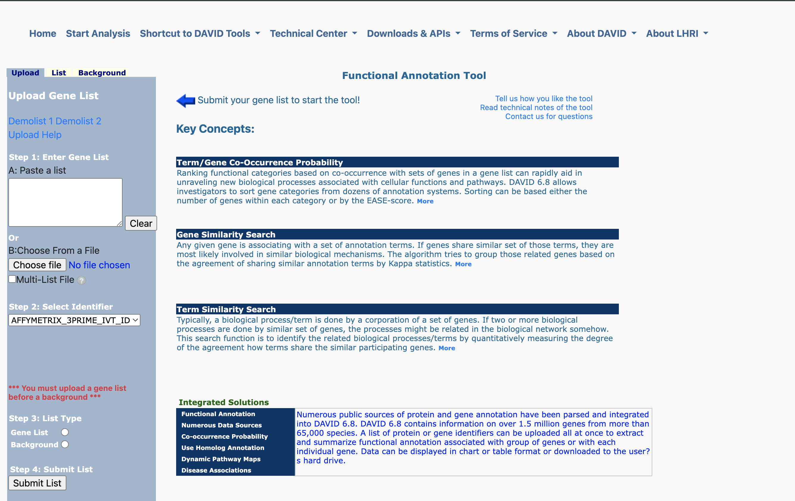
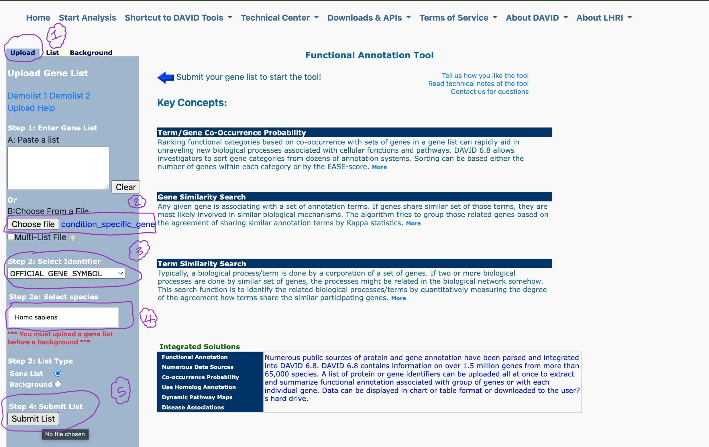
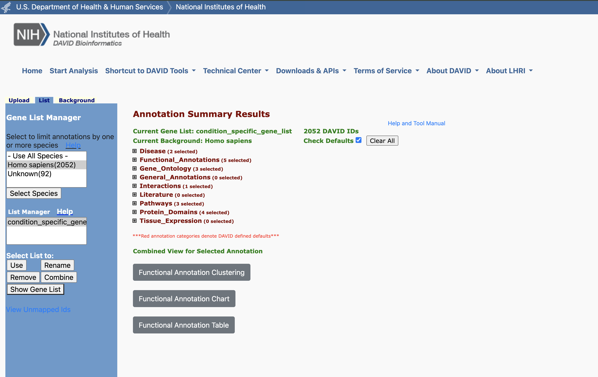
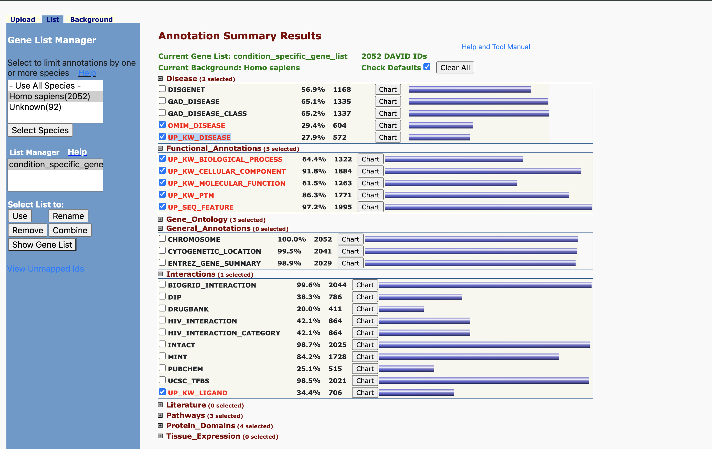
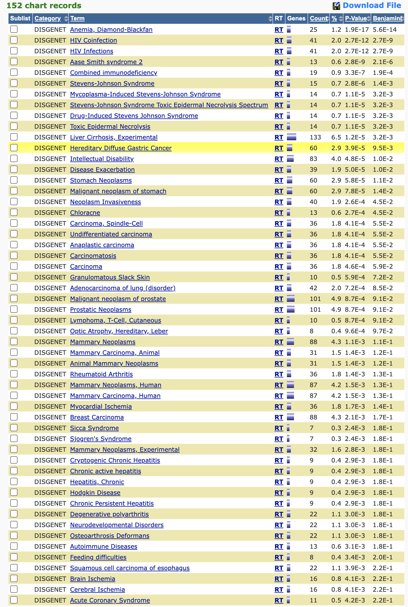
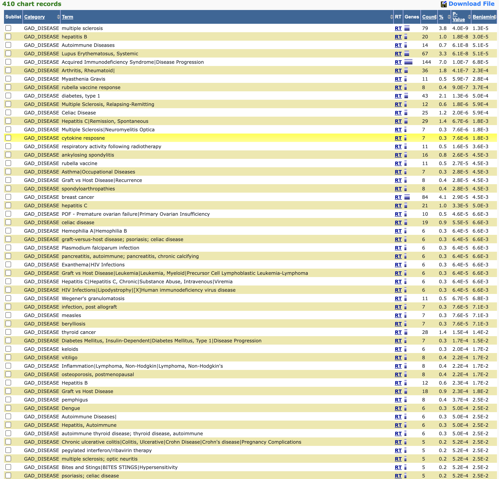

<h2 style="color:#369;"> Enrichment Analysis</h2>


<!-- <h4 style="color:#369;">Reproducibility</h4> -->

 After performing [Network Comparison](../README.md#s-4), MODA-Wrapper produces list of genes that are conserved and differentially expressed in two files `conserved_gene_list.txt` and `condition_specific_gene_list.txt` respectively, which can be used to  perform enrichment analysis, specifically on the differentially expressed genes (<font color="#f0ad4e">condition_specific_gene_list.txt</font>).</br>
This can be done as outlined below:
###### Step 1: 
- Visit  [Functional Enrichment Tool](https://david.ncifcrf.gov/summary.jsp)</br>
  </br>
 ###### Step 2: 
- In the `Upload` tab, upload the gene list (`condition_specific_gene_list.txt`) and 
choose `OFFICIAL_GENE_SYMBOL` in  <span style="text-decoration:underline;">Select Identifier</span> section.</br> 
Choose `Homo sapians` as the species name and select `Gene list`. Finally submit the gene list.
</br> These steps are summarized in the figure below:


 

</br>

###### Step 3: 
 <h6 style="color:#369;"> Enrichment Analysis Results</h6>

- After a successful upload, [DAVID](https://david.ncifcrf.gov/summary.jsp) analyzes the gene list and generates a detailed enrichment analysis result as shown below:

  

  The different parts of the analysis can be expanded to get insights into overlapping genes from our list to different genetic databases such as 
  `DISGENET`, `GAD Gene-Disease Associations`, `UniProt knowledgebase Disease` etc. 
  Hence, revealing some of the biological interpretations of our differentially co-expressed genes. 
  
###### Step 4: 
<h6 style="color:#369;"> Detailed Analysis</h6>

  - Figure below  shows overlap of `condition_specific_gene_list.txt` genes with `DISGENET` database, significantly enriched genes, susceptibility to diseases and their p-values:
   </br></br></br>

- The following list shows our gene overlap with `GAD Gene-Disease Associations` database and the corresponding list of significantly enriched genes and its associated p-values:


etc... </br>
Further detailed output data can be seen by exploring `downstream` sub-directories.
</br>
<h3 style="color:#369;">Downstream Directory</h3>

&nbsp;&nbsp;&nbsp;The `downstream` directory has the following structure:

```Bash

├── README.md
├── disease
│   ├── DISGENET.pdf
│   ├── GAD_DISEASE.pdf
│   ├── GAD_DISEASE_CLASS.pdf
│   ├── UP_KW_DISEASE.pdf
│   ├── chart_066ABBFD13651715023564226.txt
│   ├── chart_066ABBFD13651715023667174.txt
│   ├── chart_066ABBFD13651715023715558.txt
│   └── chart_066ABBFD13651715023792829.txt
├── f_2.png
├── functional_annotations
│   ├── UP_KW_BIOLOGICAL_PROCESS.pdf
│   ├── UP_KW_CELLULAR_COMPONENT.pdf
│   ├── UP_KW_MOLECULAR_FUNCTION.pdf
│   ├── UP_KW_PTM.pdf
│   ├── UP_SEQ_FEATURE.pdf
│   ├── chart_066ABBFD13651715023867762.txt
│   ├── chart_066ABBFD13651715024011605.txt
│   ├── chart_066ABBFD13651715024045321.txt
│   ├── chart_066ABBFD13651715024104250.txt
│   └── chart_066ABBFD13651715024155660.txt
├── gene_ontology
│   ├── GOTERM_BP_1.pdf
│   ├── GOTERM_BP_DIRECT.pdf
│   ├── GOTERM_CC_FAT.pdf
│   ├── chart_066ABBFD13651715024232704.txt
│   ├── chart_066ABBFD13651715024293573.txt
│   └── chart_066ABBFD13651715024356256.txt
├── general_annotations
│   ├── CHROMOSOME.pdf
│   ├── CYTOGENETIC_LOCATION.pdf
│   ├── ENTREZ_GENE_SUMMARY.pdf
│   ├── chart_066ABBFD13651715024424864.txt
│   ├── chart_066ABBFD13651715024466673.txt
│   └── chart_066ABBFD13651715024507953.txt
├── interactions
│   ├── BIOGRID_INTERACTION.pdf
│   ├── DIP.pdf
│   ├── DRUGBANK.pdf
│   ├── HIV_INTERACTION.pdf
│   ├── HIV_INTERACTION_CATEGORY.pdf
│   └── UCSC_TFBS.pdf
├── literature
│   └── HIV_INTERACTION_PUBMED_ID.pdf
├── pathways
│   ├── KEGG_PATHWAY.pdf
│   ├── REACTOME_PATHWAY.pdf
│   └── WIKIPATHWAYS.pdf
├── protein_domains
│   ├── GENE3D.pdf
│   ├── INTERPRO.pdf
│   └── UP_KW_DOMAIN.pdf
└── tissue_expression
    ├── GNF_U133A_QUARTILE.pdf
    └── UP_TISSUE.pdf

```
which contains the enrichment analysis facilitated by [DAVID](https://david.ncifcrf.gov/summary.jsp) and each sub-directory contains screenshots, converted PDF of webpage or 
the actual data (in `.txt` format) of the enrichment output, 
as the directory name suggests. </br>
Example: `disease`, `protein_domains` etc.


